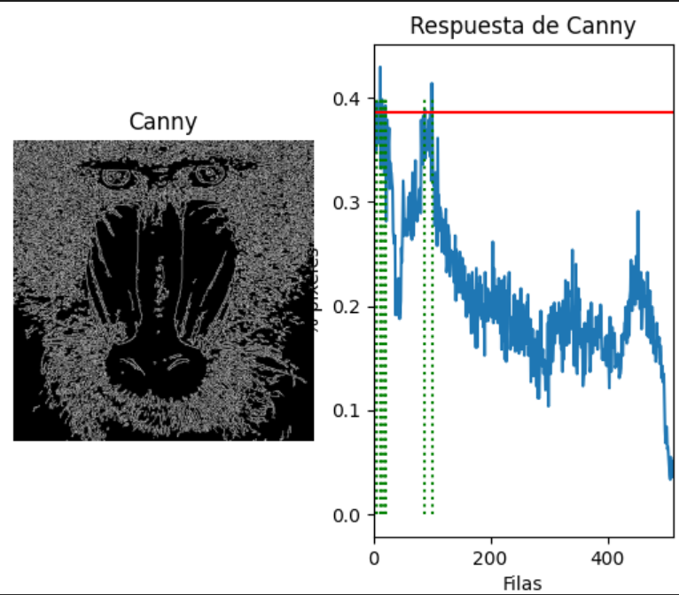
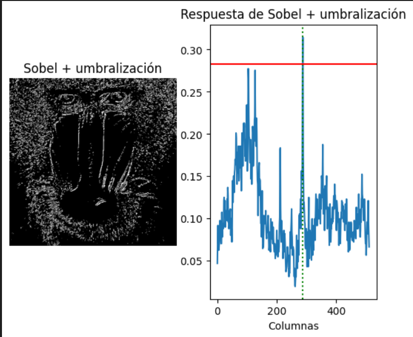
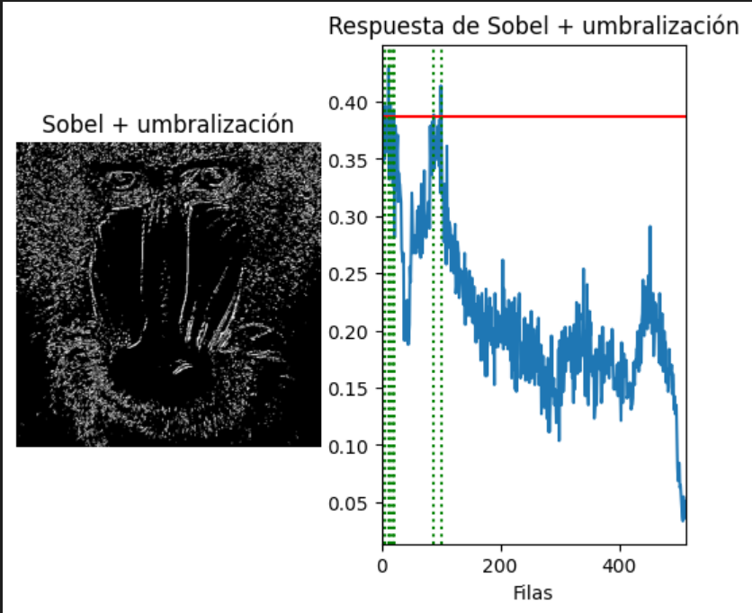
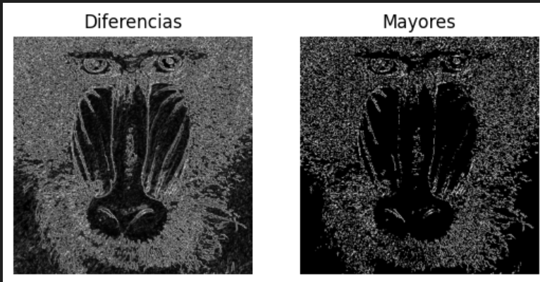
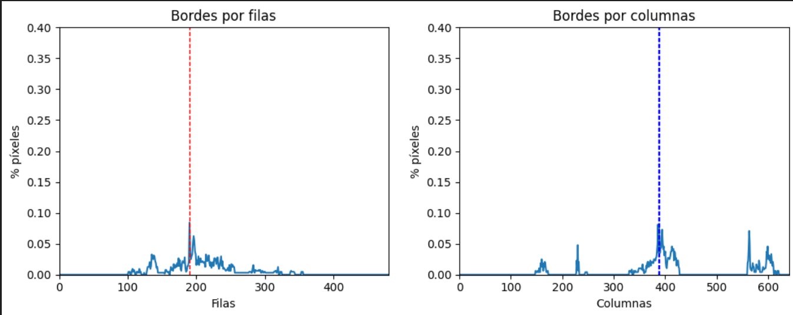

## Práctica 2. Funciones básicas de OpenCV

### Introdución
En esta practica se intenta desarrollar cuatro practicas aprendiendo más bases sobre opencv,detectores multietapa(Canny),Sobel y el  manejo de conversiones de imagenes

### 2.1. Partes del proyecto
El primero es Contar los bordes por filas y mostrar las filas con bordes por el encima de 90% del máximo donde utilizando la función de numpy np.where conseguimos encontrar la mayor concentración de píxeles de borde y luego visualizarlo
```python
rows_over_threshold = np.where(borders_by_row_ratio > 0.9 * max_border_number)[0]
```
 
El segundo ejercicio es aplicar  umbralizado a la imagen resultante de Sobel (convertida a 8 bits), y posteriormente realizar el conteo por filas y columnas similar al realizado en el ejemplo con la salida de Canny de píxeles no nulos y calcular el valor máximo de la cuenta por filas y columnas, y determina las filas y columnas por encima del 0.90*máximo. Remarca con alguna primitiva gráfica dichas filas y columnas sobre la imagen del mandril aquí utilizamos lineas donde hicimos rectas discontinuas u continuas en rojo ¿Cómo se comparan los resultados obtenidos a partir de Sobel y Canny?
Se puede distinguir que la diferencia principal entre ambos es en la calidad del borde que coje siendo canny el más avanzado de los dos.
 
  
   
En el tercer ejercicio escojimos hacer dos filtros usando el de la anterior practica de minecraft y aplicado en esta practica Canny para la deteccion de bordes multietapa.Para ello creamos una clase padre llamada cameraFilter que tiene el construtor y el metodo apply_to_image que es heredada a la clase CannyCameraFilter,NoCameraFilter y MinecraftCameraFilter donde en el metodo apply_to_image realizamos el filtro.
Por ejemplo para CannyCameraFilter se hizo lo siguiente:
```python
     def apply_to_image(self, current_frame):
        gray_frame = cv2.cvtColor(current_frame, cv2.COLOR_BGR2GRAY)
        edges = cv2.Canny(gray_frame, self.threshold1, self.threshold2)
        edges_bgr = cv2.cvtColor(edges, cv2.COLOR_GRAY2BGR)
        return edges_bgr
```
Donde se paso la imagen actual a escala de grises,luego se le paso el detector de bordes Canny y,por
último, se le paso a BGR y en el caso de minecraft este es el siguiente código
```python
    def apply_to_image(self, current_frame):
        downscaled_img = cv2.resize(current_frame, (self.columns, self.rows), interpolation=cv2.INTER_NEAREST)
        for x in range(self.rows):
            for y in range(self.columns):
                # Optimización de x * 16
                minecraft_x = x << 4
                minecraft_y = y << 4
                self.buffer[minecraft_x:minecraft_x + minecraft_block_size, minecraft_y:minecraft_y + minecraft_block_size] = MinecraftCameraFilter.find_nearest_texture(downscaled_img[x][y])
        return self.buffer
```
Donde primero se reduce la escala,luego se procesa y se reemplaza los pixeles por bloques de minecraft y después se calcula las coordenadas de salida y por ultimo se asigna la textura del bloque de minecraft.

En el cuarto ejercicio realizamos un detector de formas rojas en tiempo real donde capturamos el video
y ailamos los objetos de color rojo,luego aplicamos la deteccion de bordes canny y analizamos la densidad
de los bordes horizontalmente por filas y por columnas.Por último muestra dos graficas dinamicas marcando
con lineas donde se encuentran los contornos más fuertes de la forma roja detectada.

 


